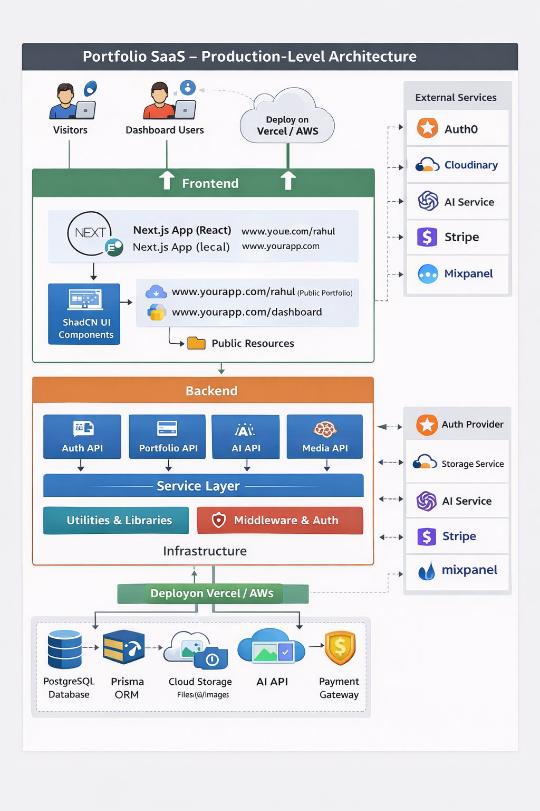

# 🚀 Portfolio SaaS

A modern AI-powered Portfolio Builder SaaS platform that helps users create professional, dynamic, and ATS-friendly portfolio websites with analytics and career insights.

---

## 🌍 Live Preview

> _Coming Soon_

---

# ✨ What We Provide

## 🧠 1. AI-Powered Resume Parsing
- Upload resume
- Extract structured data
- Generate smart suggestions
- Improve career score & ATS score

---

## 📊 2. Dashboard Analytics

- Traffic analytics
- Device split tracking
- Country-based visitors
- Skill performance insights
- Resume strength metrics

---

## 📝 3. Dynamic Resume Builder

- Experience section
- Skills section
- Contact management
- Real-time editing
- Smart UI components
- Controlled form updates

---

## 🔐 4. Secure Authentication

- Google OAuth login
- Credentials login
- JWT-based sessions
- Role-based access (USER / ADMIN)
- Multi-provider support
- Secure password hashing (bcrypt)

---

## 🎨 5. Modern UI & 3D Experience

- React Three Fiber integration
- Interactive 3D hero section
- Framer Motion animations
- Dark premium UI theme
- Tailwind CSS 4 styling system

---

## ☁️ 6. Cloud Integration

- Cloudinary image storage
- Avatar management
- AI API integrations
- Scalable MongoDB backend

---

# 🏗️ Tech Stack

## 🖥 Frontend
- **Next.js 16**
- **React 19**
- Tailwind CSS 4
- Framer Motion
- React Three Fiber
- Drei
- DnD Kit
- Recharts

---

## 🛠 Backend
- Next.js App Router API
- Mongoose 9
- MongoDB
- Zod validation
- Custom Service Layer Architecture
- Repository Pattern

---

## 🔐 Authentication
- NextAuth v4
- Google OAuth
- JWT Sessions
- Role-based control

---

## ⚡ State & API
- Axios
- Custom hooks
- Async handler wrapper
- Structured response handler

---

# 🏛 Architecture
